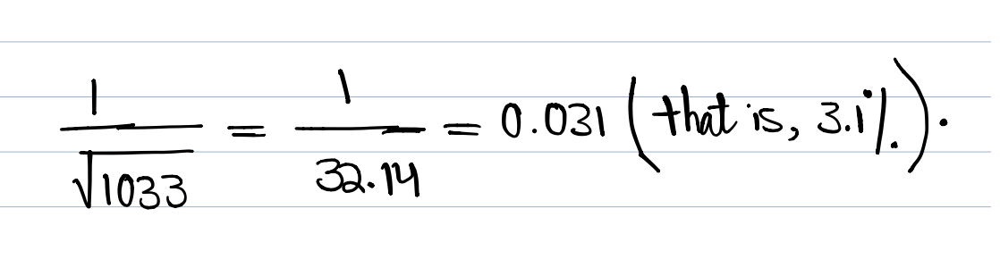

***

```{r setup, include = FALSE}
knitr::opts_chunk$set(fig.align = "center")
```


In this lab, 

- This document will serve as a sample template. 

- It is pre-formatted and already contains examples and chunks that demonestarte you how to complete your assignmet or project with *R Markdown*.


Here,  I show you how to  some additional notes: 

For example, If I want to create an ordered list (see above for unordered list), we articulate them as follows:

1- We can insert a URL in R Markdown. Here is the [**D2L Shell URL**](https://online.mun.ca/d2l/loginh/).

2- We can `highlight words` in R Mardown.

3-  *Did you notice that this item was written in italic font?* 

4- I can easily **bold word(s) in my R Markdown!**


***
# Exercise 1.11

 The population is pregnant and breast-feeding women. The sample consists of the 21 women who returned the surveys.
 
 Only 21/60*100% = 35% of the women who were contacted responded.
 
***
# Exercise 3.1
The margin of error for 95% confidence will be about 

```{r}
# You can type directly your mathematical calculations in R Markdown as follows:
```
$$
\frac{1}{\sqrt{1033}}=\frac{1}{32.14}=0.031~~~ \text{(that is, $3.1\%$).} 
$$
```{r}
# Or you can add your hand-written calculations as an image in R Markdown as follows:
```

<center>{width=50%}</center>  

***
# Exercise 11.21

Stemplot and Histogram. The distribution is roughly symmetric (it appears slightly left skewed if the stems are split), and centered at 46 (a *typical* year). Ruth’s best year was not at all unusual for him; 60 is *not* an outlier.

```{r, message = FALSE, warning = FALSE}
MyData <- read.csv(file= "ex11-21.csv", header = TRUE)
hist(MyData[,1],breaks=5,freq=TRUE)
```

```{r, message = FALSE, warning = FALSE}
xBar = mean(MyData[,1])
xBar
M <- median(MyData[,1])
M
xSD <- sd(MyData[,1])
xSD
```


```{r, message = FALSE, warning = FALSE}
summary(MyData[,1])
boxplot(MyData[,1])
```

Clearly we see that the median `r  median(MyData[,1])` is greater than the mean `r xBar`.


***

# Additional Resources

- I also recommend to take a look at this R Markdown “Cheatsheet”

(https://www.rstudio.com/wp-content/uploads/2015/02/rmarkdown-cheatsheet.pdf). 


***
