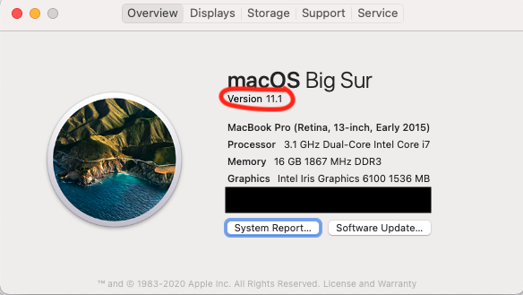
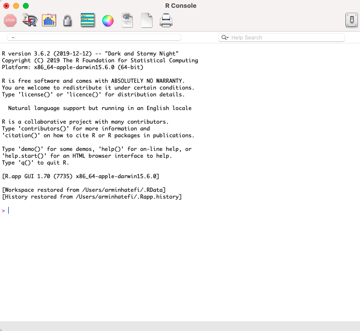
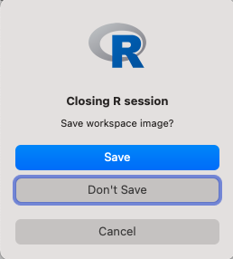
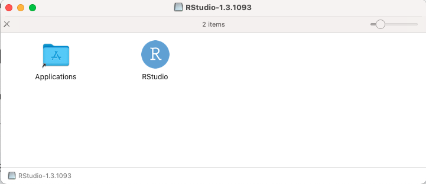
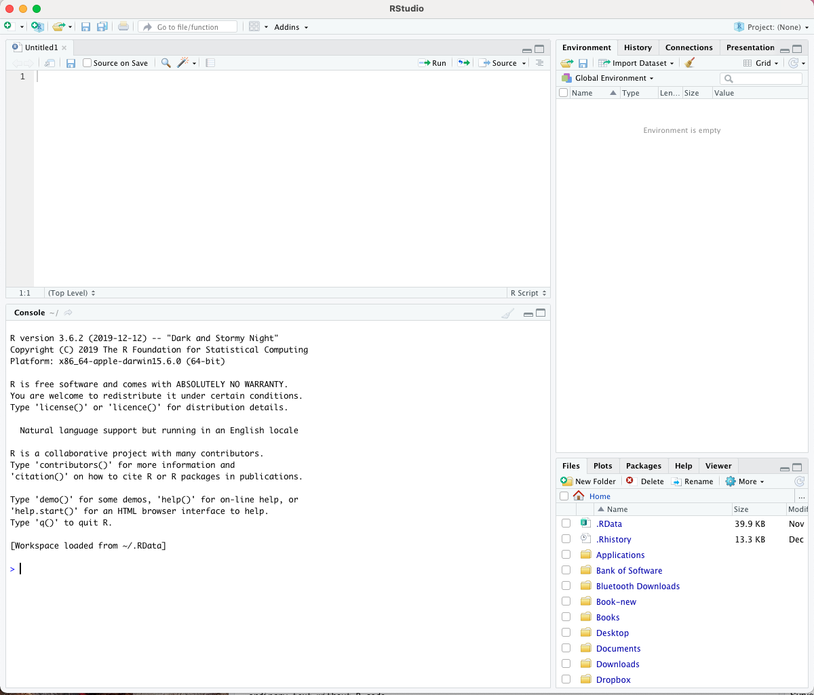

***

```{r setup, include = FALSE}
knitr::opts_chunk$set(fig.align = "center")
```


This document shows you how to  download and install  R and RStudio on an Apple Macintosh machine.

# Before we start

1. Do you know the version of your macOS? Let's check which version of macOS you have on your computer. To do this, click on the Apple icon on the top-left of your screen, then click "About This Mac". A little window should pop up with version information.

\begin{center}
\includegraphics[width=0.5\textwidth]{macOS_version}
\end{center}

<!-- <center>{width=50%}</center> -->
<!-- \ -->

2. Make sure that you have about 500 MB of free space on your machine. We will need this space to install both R and RStudio, and when the program installs the compressed files expand to take much more space.  

# How to install R

1. Go to [The website: R for Mac OS X](https://cran.r-project.org/bin/macosx/).

2. If your macOS is 10.13 (High Sierra) and higher (this should be the case for most of you), click the `R-4.1.2.pkg` link. For macOS X 10.11 (El Capitan), click the `R-3.6.3.nn.pkg` link  and for  macOS X 10.10 or 10.9, then click the `R-3.3.3.pkg`.

3. After clicking on the link, the file (package installer) will be downloaded to your computer. Once the file has been downloaded, click on the link and walk through the installation process. Accept the default options for now.

R is now **installed** on your computer.

## How to test if R works?

1. Double-click on the R icon in the Applications folder. A window titled "R Console" should pop up:

\begin{center}
\includegraphics[width=0.5\textwidth]{R_Console}
\end{center}

<!-- <center>{width=50%}</center>   -->
<!-- \ -->

The `>` character is called the prompt and is the place where we enter commands for the program to interpret. For instance, if you type `12+13` followed by the return/enter key, you will see:

```{r}
12+13
```

2. To quit R, call the quit function by typing `q()` and htting the return key.

```{r, eval=FALSE}
q()
```

R will ask you if you want to save your work:

\begin{center}
\includegraphics[width=0.3\textwidth]{Closing_R}
\end{center}
<!-- <center>{width=30%}</center>   -->
<!-- \ -->

Click on "Don't Save". You have now left R.  

We are not going to work with R enviroment directly this way. Instead, we work with an integrated ecosystem called RStudio.  RStudio will enable us to better compile our R codes and documents (e.g., assignments and project). 

# How to install RStudio

1. Go to [The website: Download the RStudio](https://www.rstudio.com/products/rstudio/download/#download).

2. Click on the "DOWNLOAD RSTUDIO FOR MAC" link. Note that it requires macOS 10.14+ (64-bit). The file download should begin immediately.

3. Once the file has been downloaded, click on it. A window should pop up:

\begin{center}
\includegraphics[width=0.5\textwidth]{Rstudio_mac}
\end{center}
<!-- <center>{width=50%}</center> -->
<!-- \ -->

Click on the RStudio icon and drag it into the Applications folder. 

RStudio is now **installed** on your computer.

**Note**: To install RStudio, you have to first install R on your machine.

## How to test if RStudio works?

1. Double-click on the RStudio icon in the Applications. A window titled "RStudio" should pop up.
It should look like this:

\begin{center}
\includegraphics[width=0.6\textwidth]{Rstudio_Window}
\end{center}
<!-- <center>{width=60%}</center> -->
<!-- \   -->

2. Like in R, the `>` character in the Console window is where we enter commands for the program to interpret.

3. To exit RStudio, click "RStudio" in the menu bar, then click "Quit RStudio". 
<!-- Alternatively, use the `Cmd-Q` shortcut. If prompted to save the workspace, do not save it. -->

**Note**: As an important rule, to avoid problems, we should avoid naming folders and files with spaces and special characters. As a general rule, I typically use `underline` to name the files and folder (without any space). For example, look at the name of this file `lab0_macOS.pdf`. As another example, if armin wants to name his assignment 1 of stats 1510, Armin can name his assignment file by `armin_hatefi_stat1510_assignment1_w22.pdf`.

*It was easy?! Yes, I know!*
